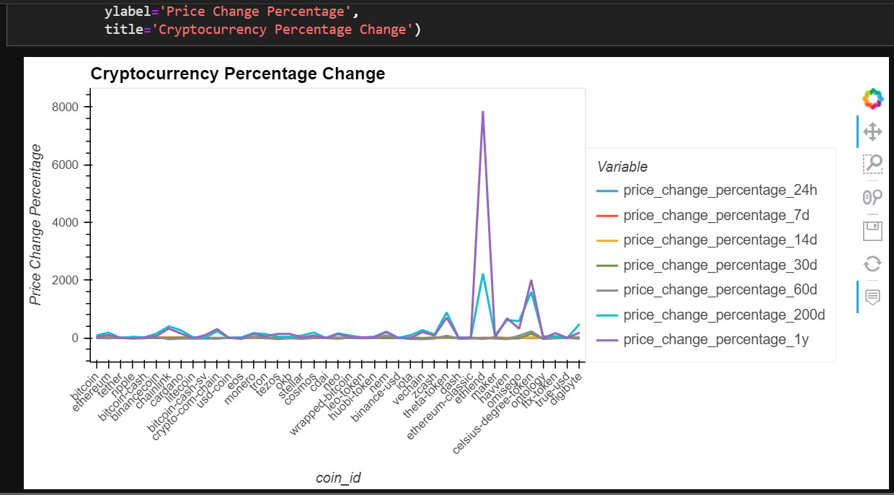
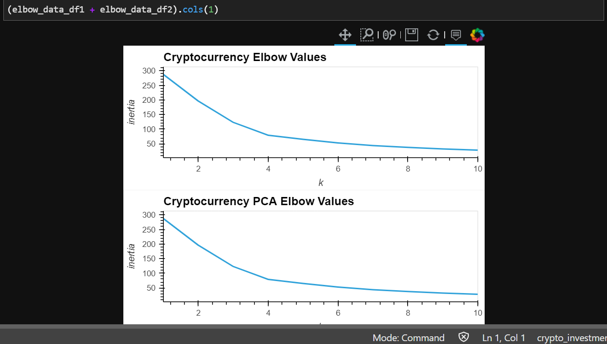
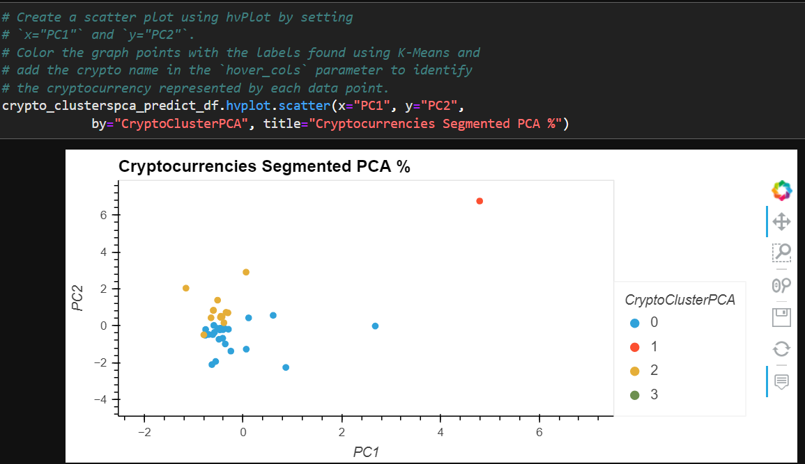

# FinTech Cryptocurrency Advisor Using K-Means and PCA Clustering

*'Welcome to my FinTech project as a 'Cryptocurrency Advisor to analyze Cryptocurrencies for portfolios'*

---

## Background
This project constructs a program to propose a novel approach to build investment portfolios based on cryptocurrencies. Looking at other factors beyond returns and volatility to get an edge in cryptocurrency metrics this program pursues better investment performance beyond the competition for crypto-portfolios using machine-learning. 

The increasing interest in cryptocurrency investing has made this asset class popular for portfolios because they expand diversification in the hi-risk aggressive growth asset classes. Utilizing python and unsupervised machine learning code, this program uses ‘K-Means’ algorithms to group cryptocurrencies in clusters to analyze performance in different time periods. The time performance results are then revealed visually to assist with investment decisions of cryptocurrencies for portfolios.

This approach brings greater identification of performance in the increasingly crowded asset class of cryptocurrencies.  As such, one can access risks and performance across time periods using algorithms. Thus, offering a keener visualization of each cryptocurrency’s durability and fit for selection into building a portfolio. 

The FinTech app technology in this program utilizes unsupervised machine learning algorithms in models to find similar relationships among data points for segmentation. To achieve this, imports from python’s ‘scikit-learn’ utilizes algorithms and ‘pyviz hvploy’ visualizes the resulting data in the ‘Jupyter Notebook’.  

---

## Technologies

The software operates on python 3.9 with the installation package imports embedded with Anaconda3 installation.Tthe tools that you need for this module, include [scikit-learn] and [pyviz hvploy] libraries. ‘Scikit-learn’ includes [sklearn.cluster import KMeans] for segmentation into an algorithm;   [sklearn.decomposition import PCA] for data reduction to optimize the identification of clusters when using the ‘KMeans’ algorithm; [sklearn.preprocessing import StandardScaler] to normalize and transform date to numerical values for clustering.

'PyViz' is a single platform for accessing multiple visualization libraries from Python. PyViz library hvPlot is utilized for charting in this program. 

* [anaconda3](https://docs.anaconda.com/anaconda/install/windows/e) . 

* [sklearn.cluster import KMeans](https://scikit-learn.org/stable/modules/clustering.html#k-means) 

* [sklearn.decomposition import PCA](https://scikit-learn.org/stable/modules/unsupervised_reduction.html#pca-principal-component-analysis) 

* [sklearn.preprocessing import StandardScaler](https://scikit-learn.org/stable/modules/generated/sklearn.preprocessing.StandardScaler.html)

* [pyviz hvplot](https://hvplot.holoviz.org/index.html#) .

---

## Installation Guide

Before running the applications first activate the Conda development environment and launch JupyterLab to import the following required libraries apps. For ‘Scikit-learn’, first confirm it is installed in the conda environment through the terminal by following the procedure below. If not installed, open a terminal window, and then complete the following step A4. If ‘pyviz hvplot’ are not installed with anaconda, then complete the following steps below B4, using the conda terminal command below provided by Anaconda.

```python libraries
import pandas as pd
import hvplot.pandas 
from pathlib import Path
from sklearn.cluster import KMeans
from sklearn.decomposition import PCA
from sklearn.preprocessing import StandardScaler  

    A1) Activate the Conda [dev] environment; 2) Run the following command: [conda list scikit-learn];
        3) confirm the installation. 

        4)	if the terminal doesn’t display installation run the following [pip install -u scikit-learn] 

    B1) Activate your Conda [dev] environment. 2) Run the following command: [conda list hvplot]; 
        3) confirm the installation. 

        4)	if the terminal doesn’t display installation run the following [pip install -c pyviz hvplot] 


```

---
# Usage

This application is launched from web-based JupyterLab utilizing Pandas which is designed for data analysis to write and read code in an IDE and review results through the Python libraries. The Anaconda3 software application includes the Pandas libraries; **'PyViz' as a single platform for accessing PyViz libraries, including hvPlot.** They are utilized for high-level plot charts in this program from the Python visualization package. **HoverTool**is imported from the Bokeh library for **hvplot**. It utilizes data frames and plot charts in an integrated Conda development environment. 

The program is developed in Jupyter notebooks on a **.ipny** file. The **scikit-learn** library makes it much easier to explore data using algorithms and statistical models to assist in making future decisions without having to write additional code using conditional statements and logic manually. With the interactive **pyviz hvplot** library,  data visualization is improved in chart plot presentations. Together they advance functions to create informative visualizations from the Pandas DataFrames and data metrics. 

 

 

 


```python
crypto_investments.ipynb
```
 

---

## Contributors

*Provided to you by digi-Borg FinTek*, 
Dana Hayes: nydane1@gmail.com

---

## License

Columbia U. Engineering


